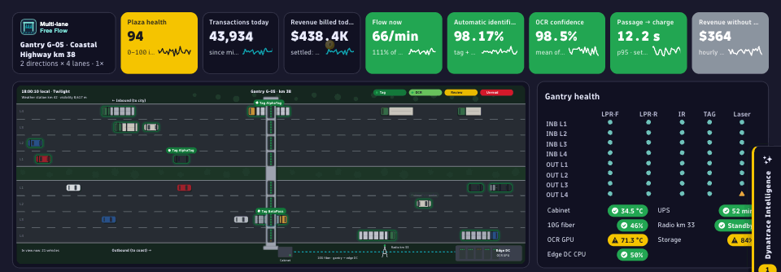
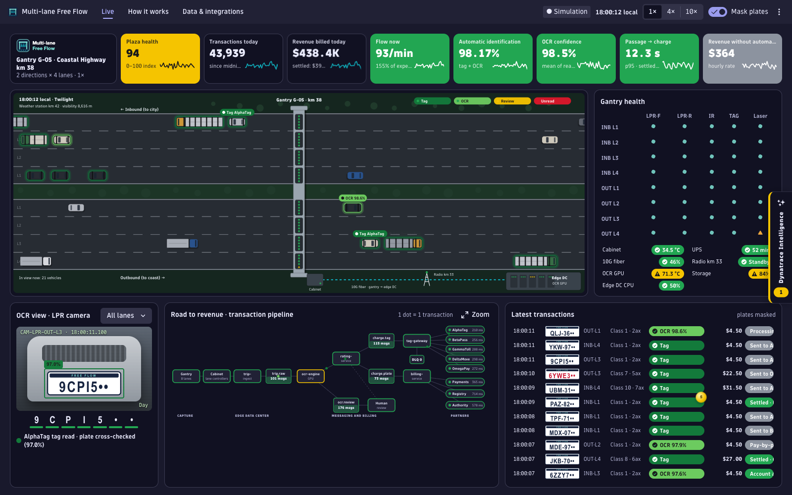
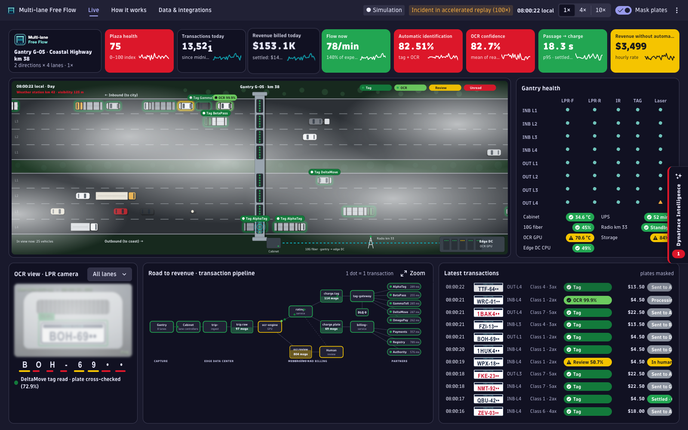
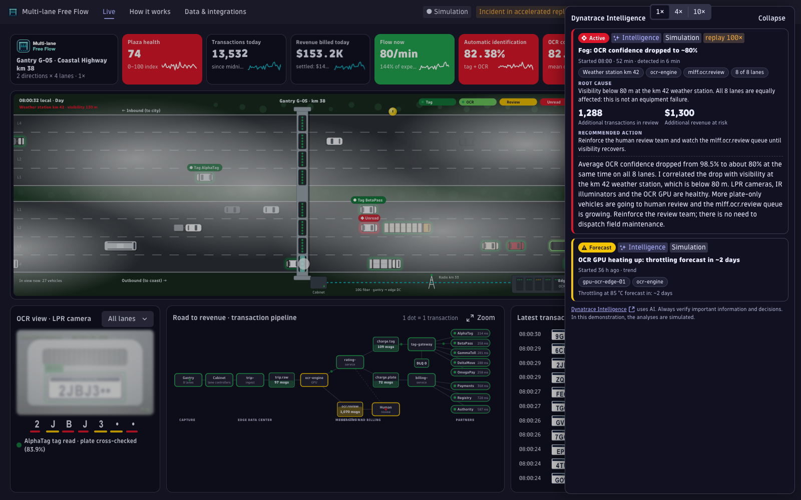
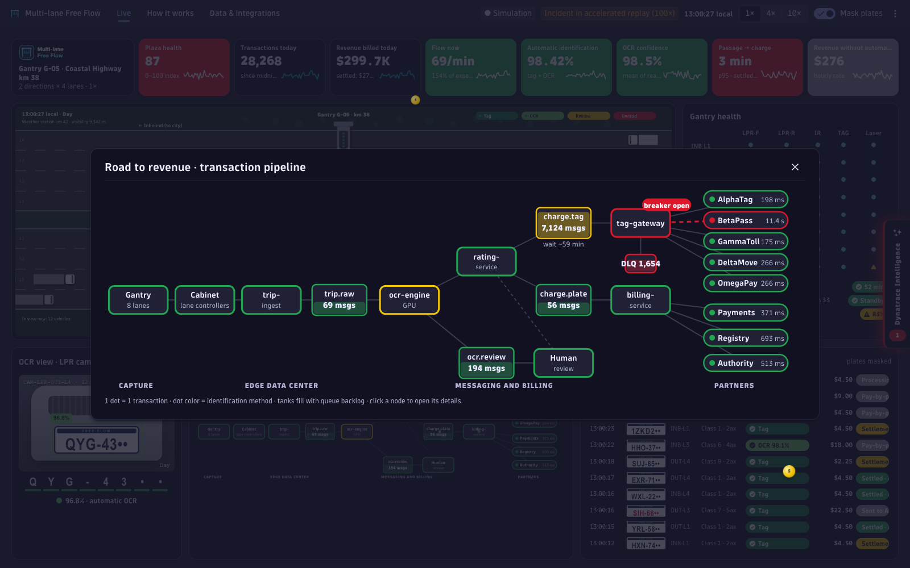
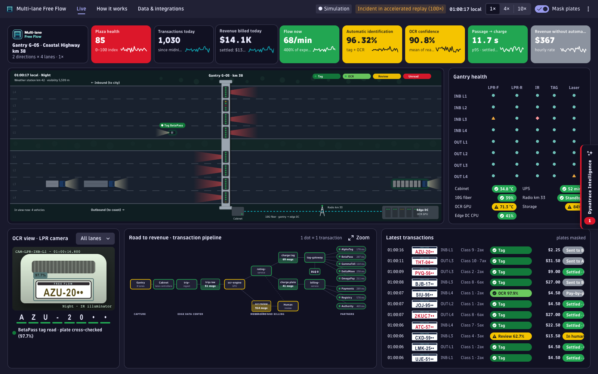
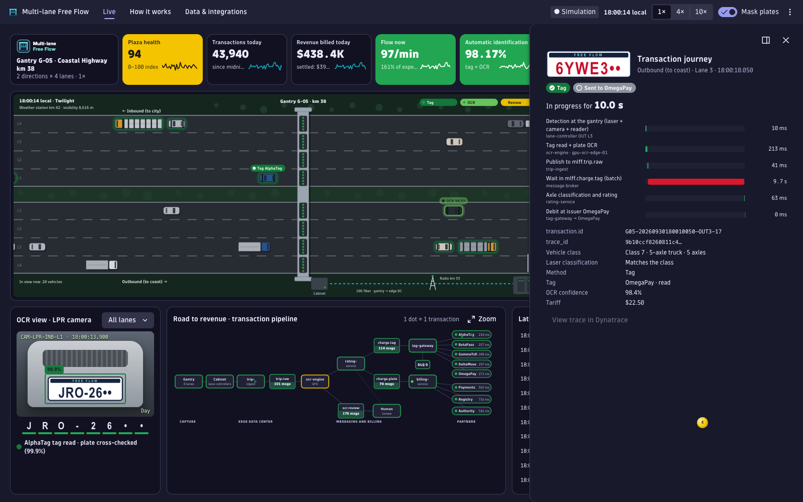

# Multi-lane Free Flow for Dynatrace

🌐 **Project page:** https://adrianorafael.github.io/multi-lane-free-flow/

**Multi-lane Free Flow for Dynatrace** is an app created and maintained by [@adrianorafael](https://github.com/adrianorafael) on GitHub.

It shows, in motion, the life of a **multi-lane free-flow (MLFF) toll gantry**: vehicles cross
eight lanes, every tag read or plate read turns into a color on the vehicle itself, and every
transaction travels the *road to revenue* — edge data center, queues, rating, tag issuers — until
the charge is settled. On top of it, a scripted **Dynatrace Intelligence** layer detects, explains
and puts a price on the incidents a presenter triggers: fog, a failed IR illuminator, a tag issuer
outage, a fiber cut, an overheating OCR GPU and a holiday traffic peak. It is built for customer
demonstrations and runs on **simulated data** for a **fictitious operator** ("Multi-lane Free Flow").

This app is **not finished** — it is a **demonstration app** meant to show how easy it is
to build your own Dynatrace App through **vibecoding**, following the official documentation
at [developer.dynatrace.com](https://developer.dynatrace.com/) and using **Strato Design**
to style it with Dynatrace's Design System.

> ⚠️ **Disclaimer**
>
> This app is provided by the developer with **no affiliation with Dynatrace** and **no responsibility** for any failures, issues, or consumption of resources and licenses. It is a **study version with no official support**.
>
> Deciding to download and install it in your environment is **at the user's own risk**. You are equally free to improve and expand its features.

**Current version:** `0.1.0` (see [`app.config.json`](app.config.json) and [CHANGELOG.md](CHANGELOG.md)).



| Live view at the evening peak | Fog incident | Dynatrace Intelligence |
| --- | --- | --- |
|  |  |  |
| **Pipeline zoom (tag issuer outage)** | **Night: IR illuminator failure** | **Transaction journey** |
|  |  |  |

*Screenshots (dark theme) show simulated data for a fictitious operator.*

## Overview

A deterministic simulator (`ui/app/sim/`) generates weekday traffic, tag and plate reads,
human review, charges, queues, partner latencies and equipment health, calibrated to realistic
operating numbers. React renders the KPIs and panels four times per second; the gantry scene
and the pipeline particles are animated imperatively in SVG from a single animation loop.
**The app reads nothing from and writes nothing to your environment** — no DQL, no app
functions, no OAuth scopes — so it installs in any tenant and costs no Grail query consumption.
The *Data & integrations* tab documents exactly which events, metrics and registries would have
to be connected to run it on real data.

## Table of Contents
1. [Prerequisites](#prerequisites)
2. [Install the App in Your Environment (Step by Step)](#install-the-app-in-your-environment-step-by-step)
3. [Installation and Configuration](#installation-and-configuration)
4. [Running in Development Mode](#running-in-development-mode)
5. [Publishing to Environment (Deploy)](#publishing-to-environment-deploy)
6. [Publishing to Another Environment](#publishing-to-another-environment)
7. [Required OAuth Scopes](#required-oauth-scopes)
8. [App Features](#app-features)
9. [Important Behaviors](#important-behaviors)
10. [Query Cost & Consumption (DPS)](#query-cost--consumption-dps)
11. [Troubleshooting](#troubleshooting)
12. [Relevant File Structure](#relevant-file-structure)
13. [Available Scripts](#available-scripts)
14. [Versioning & Changelog](#versioning--changelog)

## Prerequisites

- Node.js 24 (the version supported by `dt-app`; newer versions work with a warning)
- npm >= 9
- A Dynatrace SaaS environment (3rd gen platform) where you may install custom apps
- IAM permissions `app-engine:apps:install` and `app-engine:apps:run` (plus `app-engine:apps:delete` to uninstall)

```bash
npm install
```

## Install the App in Your Environment (Step by Step)

The whole path from zero to the app running for every user of your tenant:

1. **Check your permissions.** Your user needs `app-engine:apps:install` and
   `app-engine:apps:run` in the target environment (ask your Dynatrace admin if not).
2. **Get the code.**
   ```bash
   git clone https://github.com/adrianorafael/multi-lane-free-flow.git
   cd multi-lane-free-flow
   npm install
   ```
3. **Point it at your environment.** In `app.config.json`, replace `YOUR-ENVIRONMENT` in
   `environmentUrl` with your tenant ID — copy it from your browser's address bar. The result
   has the form `https://YOUR-TENANT-ID.apps.dynatrace.com/`.
4. **(Optional) Try it first** without installing: `npx dt-app dev` and open the link it prints.
5. **Install it:**
   ```bash
   npx dt-app deploy
   ```
   The first run opens your browser for the Dynatrace login. The app declares no OAuth
   scopes, so there is no data-access consent screen.
6. **Open it:** in Dynatrace, go to **Apps** (or search) → **Multi-lane Free Flow**.
7. **Present it:** press **P** for the presenter panel, **1–6** for the scenarios, **I** for
   Dynatrace Intelligence — or start the 5-minute automatic tour from the presenter panel.
8. **Update later:** bump `app.version` in `app.config.json`, then `npx dt-app deploy` again.
9. **Uninstall:** `npx dt-app uninstall` (needs `app-engine:apps:delete`).

## Installation and Configuration

### Step 1 — Configure the target environment in `app.config.json`

```json
{
  "environmentUrl": "https://YOUR-ENVIRONMENT.apps.dynatrace.com/",
  "app": { "id": "my.multi.lane.free.flow" }
}
```

Replace `YOUR-ENVIRONMENT` with your own Dynatrace tenant ID. The environment URL has the
form `https://<tenant-id>.apps.dynatrace.com/` — copy it from the address bar of your
Dynatrace environment.

**IMPORTANT:** the app ID must start with `my.` for unsigned apps. IDs without that prefix
require digital app signing.

Files that ship with a `YOUR-ENVIRONMENT` placeholder:

| File | What to replace | Used by |
| --- | --- | --- |
| `app.config.json` | `environmentUrl` | `dt-app dev` / `dt-app deploy` |
| `.vscode/launch.json` | the debug `url` | in-IDE debugging only |
| `.env.example` → copy to `.env` | `DT_ENVIRONMENT`, `DT_PLATFORM_TOKEN` | the optional MCP servers in `.mcp.json` (never committed) |

### Step 2 — Authenticate

The first `npx dt-app dev` or `npx dt-app deploy` opens your browser for the Dynatrace login.
This app declares **no OAuth scopes**, so there is no consent screen for data access.

## Running in Development Mode

```bash
npx dt-app dev
```

**Open the link printed in the terminal, not `localhost:3000` directly** — the app must run
inside the Dynatrace context. Changes hot-reload.

## Publishing to Environment (Deploy)

```bash
npx dt-app deploy
```

Builds and publishes to the environment in `app.config.json`. Afterwards the app is
available to all tenant users under **Dynatrace → Apps → Multi-lane Free Flow**.
Every new deployment needs a new `app.version` in `app.config.json`.

## Publishing to Another Environment

Deployment is per environment.

1. Edit `environmentUrl` in `app.config.json`
2. `npx dt-app deploy` (log in to the new environment when the browser opens)

**ATTENTION:**
- Presenter preferences (masking, pinned camera, dashboard ID) live in each browser's
  `localStorage`; nothing migrates between environments or browsers.
- The app needs no Grail tables, so it renders the same in every environment.
- Users still need `app-engine:apps:run` to open the app.

## Required OAuth Scopes

| Scope | Purpose |
| --- | --- |
| — | **None.** The app runs entirely in the browser on simulated data. |

Adding a scope after deployment requires every existing user to re-authorize on next load,
and is therefore a MAJOR version bump.

## App Features

### Live view
- **Gantry scene:** 2 directions × 4 lanes; each vehicle is one simulated transaction. At the
  gantry, a laser sweep reveals the axles, tag reads pulse from the reader, the camera flashes,
  and a colored halo plus a badge show the result — dark green *tag*, green *automatic OCR*,
  yellow triangle *human review*, red diamond *unread*. Headlights and IR illuminator cones at
  night, animated fog, the gantry cabinet, the fiber link and the edge data center.
- **KPI ribbon:** plaza health (0–100), transactions and revenue today (rolling counters), flow
  vs expected, automatic identification, OCR confidence, passage-to-charge p95 and hourly revenue
  without automatic identification — each with a sparkline and green / yellow / red thresholds.
  The revenue-without-automatic-ID tile is a loss metric, so it is never green: neutral below
  its warning threshold, then yellow and red.
- **OCR view:** the last plate read, decoded character by character with per-character
  confidence; the image blurs in fog and goes dark when the IR illuminator fails.
- **Road to revenue:** one dot per transaction flowing through capture, edge services, queue
  tanks, rating, tag gateway and partners. When an issuer fails, the circuit breaker opens,
  dots pile up in the queue and burst out on recovery. **Zoom** opens the pipeline in a large
  modal with its own live animation.
- **Gantry health:** 8 lanes × 5 devices (front / rear LPR, IR illuminator, tag reader, laser)
  plus cabinet, UPS, fiber, backup radio, OCR GPU, storage and edge CPU.
- **Latest transactions:** fictitious plates (masked by default), class, method, tariff and
  charge status; every settled charge sends a coin flying to the revenue KPI.
- **Transaction journey:** click any vehicle or row for a trace-like waterfall from detection
  to settlement.

### Dynatrace Intelligence
- A collapsible tab on the right edge (key **I**) with a counter of active problems.
- Cards with root cause, affected entities (click to highlight them in the scene or pipeline),
  live impact, time to detection, recommended action and a streamed explanation.
- Clearly labelled as *Simulation*, with the Strato AI chip and disclaimer.

### Presenter tools
- Six scenarios, replayed at 100× so that hours of incident fit in a minute: holiday exodus,
  mountain fog, IR illuminator failure on inbound lane 3, BetaPass tag issuer timeouts, fiber
  cut with store-and-forward, OCR GPU throttling.
- Presenter panel (**P**): scenarios, 1× / 4× / 10× speed, simulated hour, seed, restart, optional
  dashboard link, automatic 5-minute tour.
- **Dynatrace sources** overlay (**D**): what would feed each panel in real life.
- Demo summary (**R**), TV mode (**T**), pause (**Space**), plate masking (**M**).

### Documentation tabs
- **How it works:** what is simulated and what changes with real data.
- **Data & integrations:** the data path from the roadside to Dynatrace, event fields,
  metrics per device type (cameras, IR illuminators, tag readers, laser scanners, lane
  controllers, cabinet, UPS, backhaul, edge data center, weather station), reference data and
  a rollout order.

## Important Behaviors

### Everything is simulated
No data leaves or enters the tenant. The operator, its gantry, tag issuers, partners, plates
and incidents are fictitious. The Dynatrace Intelligence texts are scripted per scenario.

### Incidents run in accelerated replay
Rates (%, p95, vehicle colors) come from the live vehicles; accumulated values (queue backlog,
revenue at risk or delayed, incident duration) follow a scripted timeline replayed at about 100×.
The header shows *Incident in accelerated replay (100×)* whenever this is active.

### Local time zone
The plaza follows the viewer's local time: volume, day / night and headlights change with the
clock. Use the presenter panel's simulated hour for a peak at any time of day.

### Deterministic by seed
The same seed replays exactly the same sequence of vehicles, so a demo can be rehearsed.

### Hidden tabs
When the browser tab is hidden, only the daily totals advance; vehicles resume when you return.

### Preferences are per browser
Masking, pinned camera, TV mode and the dashboard ID are stored in `localStorage`.

## Query Cost & Consumption (DPS)

> ⚠️ **Read this before running the app in a production environment.** Apps that run live
> DQL queries against Grail consume Dynatrace Platform Subscription (DPS) budget. Understand
> and measure it to avoid surprises on your bill.

### What drives cost in this version

**Nothing.** Version `0.1.0` runs **no DQL queries and no app functions**; all data is generated
in the browser. It creates **no Grail query consumption** ("Grail Query – data analyzed").

| Factor | Effect on cost | This version |
| --- | --- | --- |
| **Auto-refresh / polling** | 🔴 Dominant in data-driven apps — 1 query per interval, per open tab | Not applicable (no queries) |
| **Timeframe width** | Wider window = more data scanned | Not applicable |
| **Concurrent users / tabs** | Multiplies linearly | No effect |
| **Data volume** | More records = more GB scanned | No effect |

### If you add a real-data mode (roadmap, not shipped)

A live gantry view on real data would poll Business Events, and polling is exactly the
dominant cost driver described above. No such query ships in this version, so there is no
measured figure to publish yet — measure `scannedBytes` for your own query before enabling it:

```
GB/month ≈ GB_per_query × queries_per_hour × hours_per_day × days × concurrent_tabs
cost     ≈ GB/month × your DPS "Grail Query – data analyzed" rate
```

| Scenario | Queries/month | GB scanned | Est. cost* |
| --- | --- | --- | --- |
| Version 0.1.0 (simulator), any usage | 0 | 0 | None |

\* For a future real-data mode, multiply your measured GB by your contract's *"Grail Query –
data analyzed"* rate — the amount depends entirely on your rate card.

### How to measure precisely (recommended)

1. Paste the query into a Dynatrace **Notebook** and inspect the scan metadata.
   Programmatically, `queryExecute(...)` returns `metadata.grail.scannedBytes` and
   `scannedRecords` — the real cost per execution.
2. **Account Management → Cost & usage → Grail Query** confirms aggregated consumption
   after running on/off scenarios.

### How to reduce cost (for a future real-data mode)

- Poll at the slowest interval the demo tolerates, and pause polling when the tab is hidden.
- Keep the window narrow (minutes, not hours) and read only new records since the last poll.
- Project only the fields you need with `| fields …` — Grail is columnar.
- Pre-aggregate KPIs (metrics or `makeTimeseries`) instead of re-reading raw events.

## Troubleshooting

| Symptom | Cause & fix |
| --- | --- |
| `app.config.json` validation error: `'app.description' must NOT have more than 80 characters` | Shorten the description. |
| Deploy fails because the version already exists | Bump `app.version` in `app.config.json` (and CHANGELOG, README, page). |
| The app opens at `localhost:3000` but looks broken | Open the link printed by `npx dt-app dev` — the app must run inside Dynatrace. |
| Few vehicles on screen | It is night or early morning in your time zone: use the presenter panel's *6 pm* simulated hour or the holiday exodus scenario. |
| Nothing moves | The simulation is paused (Space) or the browser tab was hidden; press Space. |
| Animations feel heavy on a slow laptop | Use 1× speed, avoid combining several scenarios, or enable the OS "reduce motion" setting (the app then disables particles and continuous vehicle motion). |
| "Open dashboard" button missing | Paste a dashboard document ID into the presenter panel; the button only shows when set. |
| Warning about the Node.js version | `dt-app` supports Node 24; newer versions work but print a warning. |

## Relevant File Structure

- **`app.config.json`** — environment URL (placeholder), app id, version, icon, scopes (none).
- **`ui/app/sim/`** — the simulator: `engine.ts` (traffic, identification, charging, queues,
  health, incident replay), `model.ts` (curves, classes, tariffs, issuers), `scenarios.ts`
  (the six scenarios and their Intelligence texts), `journey.ts`, `types.ts`,
  `__tests__/calibration.test.ts`.
- **`ui/app/scene/`** — the animated gantry (`GantryScene.tsx`, `vehicle-renderer.ts`).
- **`ui/app/components/`** — KPI ribbon, OCR camera, pipeline, transactions feed, gantry health,
  Dynatrace Intelligence drawer, details panel, presenter panel, summary.
- **`ui/app/pages/`** — `Live.tsx`, `HowItWorks.tsx`, `DataIntegrations.tsx`.
- **`ui/app/data/integration-map.ts`** — the real-data field and metric map.
- **`ui/app/theme/colors.ts`** — status and brand palette (single source of color).
- **`ui/assets/`** — fictitious brand logos and the app icon.
- **`specs/`** — the approved spec. **`docs/`** — the project page (GitHub Pages), with
  `docs/img/` holding the screenshots and the animated preview.
- **`scripts/`** — `scan-secrets.sh`, optional `pre-commit` hook, `test-sim.mjs`.

## Available Scripts

| Script | Runs | Description |
| --- | --- | --- |
| `npm run start` | `dt-app dev` | Development mode with hot reload |
| `npm run build` | `dt-app build` | Production build |
| `npm run deploy` | `dt-app deploy` | Build and deploy to the configured environment |
| `npm run uninstall` | `dt-app uninstall` | Remove the app from the environment |
| `npm run update` | `dt-app update` | Update `@dynatrace` packages and apply migrations |
| `npm run lint` | `eslint .` | Lint, including security and secret rules |
| `npm run typecheck` | `tsc --noEmit` | Type check |
| `npm run test:sim` | `scripts/test-sim.mjs` | Simulator calibration tests |
| `npm run scan:secrets` | `scripts/scan-secrets.sh` | Secret and tenant-data scan of the working tree |

Optional: install the pre-commit secret scan with `cp scripts/pre-commit .git/hooks/pre-commit`.

## Versioning & Changelog

This app follows [Semantic Versioning](https://semver.org/), where "breaking" means
breaking **for the person running the app**:

| Bump | When |
| --- | --- |
| **MAJOR** | A scope changed (everyone must re-consent) · persisted state format changed without migration · a feature was removed · a default changed in a way that raises cost |
| **MINOR** | New view, chart, filter or setting — nothing existing breaks |
| **PATCH** | Bug fix, copy, styling, dependency bump, query optimized with identical results |

- `app.config.json` → `app.version` is the single source of truth.
- Every release is recorded in [CHANGELOG.md](CHANGELOG.md).
- The same version is never published twice.

To learn more about the Dynatrace Platform, see
[Dynatrace Developer](https://developer.dynatrace.com/).

---

Built following [Development Pattern for Dynatrace](https://github.com/adrianorafael/development-pattern-for-Dynatrace).
Licensed under the [MIT License](LICENSE).
